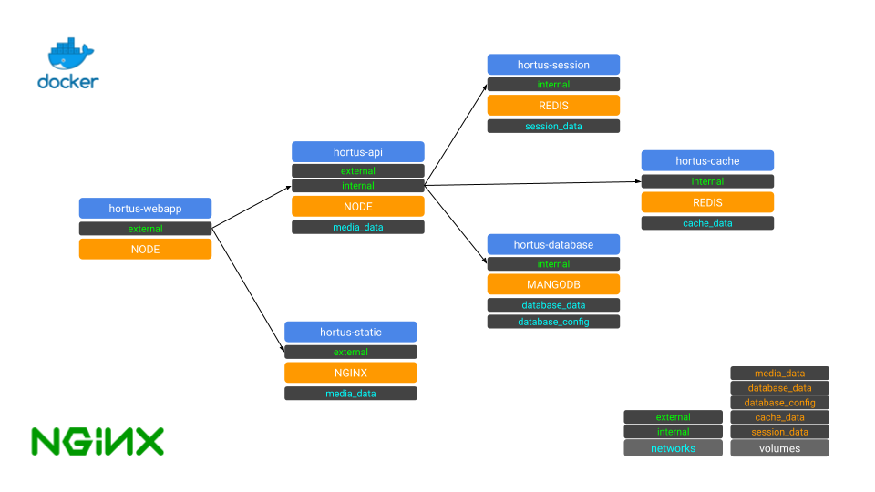

[](https://www.repostatus.org/#wip) [](https://app.netlify.com/sites/hortus/deploys)

# Hortus Web Client

Gardening planner, monitoring and automation web application. It connect to [Hortus Server](https://github.com/alexandrelamberty/hortus-server/).

It is part of the [Hortus](https://github.com/alexandrelamberty/hortus) project

## Development Roadmap:

- [ ] Architecture
	- [x] React-Router
	- [ ] Redux 
- [ ] UI
	- [ ] Screens
	- [ ] Modal
	- [ ] Form and List

## Architecture


## Technologies

- [NPM](https://www.npmjs.com/)
- [Docker](https://www.docker.com/)
- [React](https://reactjs.org/)

## Requirements

- [NPM](https://www.npmjs.com/)

## Installation

## Configuration

Rename the `.env.sample` to `.env`.

## Development

This project depends on [Hortus Server](https://github.com/alexandrelamberty/hortus-server/)

Once the server is up and running you can start the web application

```bash
npm run start
```

## Test

## Deployment

## Reference
- [React Context](https://wanago.io/2020/09/28/react-context-api-hooks-typescript/)
- [PostCSS 7 compatibility build](https://tailwindcss.com/docs/installation#post-css-7-compatibility-build)
